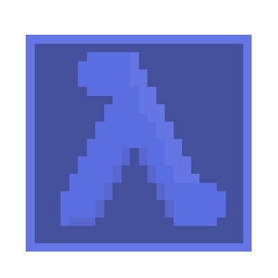

</img>
<h1 align="center">CAAR - The modern lisp machine</h1>

CAAR is an effort at writing a modern [Lisp machine](https://en.wikipedia.org/wiki/Lisp_machine).

The goal of this project is to be able to run a somewhat functional operating system written fully in R5RS Scheme.

## Todo
### Emulator
- [x] CPU
- [x] RAM
- [ ] video memory
- [ ] IO ports
### Assembler
- [ ] Basic assembler
- [ ] preprocessor

### R5RS compiler
- [ ] everything

